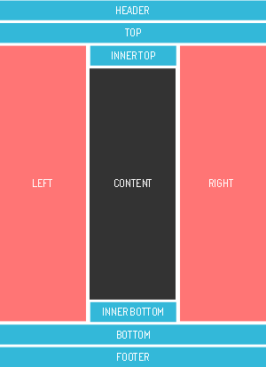

# templator-bootstrap

[Templator](https://github.com/Kristories/Templator) templates for [Twitter Bootstrap](http://getbootstrap.com)

## Preview


## Positions



## Code

```php
$templator->blocks(array(
    'header'        => array(),
    'top'           => array(),
    'inner_top'     => array(),
    'left'          => array(),
    'right'         => array(),
    'inner_bottom'  => array(),
    'bottom'        => array(),
    'footer'        => array(),
));
```